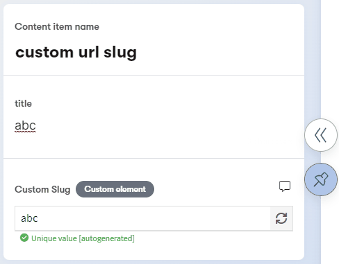

# Unique URL slug

This is a [custom element](https://docs.kontent.ai/tutorials/develop-apps/integrate/integrating-your-own-content-editing-features) for [Kontent by Kentico](https://kontent.ai) that generates a URL slug based on a text field or a custom value. It also checks for uniqueness of such value and can generated unique value if same url slug is found.



## Setup

1. Deploy the code to a secure public host
   - See [deploying section](#Deploying) for a really quick option
2. Follow the instructions in the [Kontent documentation](https://docs.kontent.ai/tutorials/develop-apps/integrate/integrating-your-own-content-editing-features#a-3--displaying-a-custom-element-in-kentico-kontent) to add the element to a content model.
   - The `Hosted code URL` is where you deployed to in step 1
   - Pass the necessary parameters as directed in the [JSON Parameters configuration](#json-parameters) section of this readme.
3. Deploy your server repeater for Preview API calls (details below)

## Deploying

Netlify has made this easy. If you click the deploy button below, it will guide you through the process of deploying it to Netlify and leave you with a copy of the repository in your GitHub account as well.

[](https://app.netlify.com/start/deploy?repository=https://github.com/hzik/custom-url-slug)

## JSON Parameters

You need to specify the `repeater` url, `generates_from` and `codename` parameters in order to make the element work. There are also optional `force_uniqueness` and `restricted_chars` parameters:

```Json
{
    "repeater": "https://domain.com/repeater",
    "generates_from": "title",
    "codename": "custom_slug",
    "force_uniqueness": "true", // default "false"
    "restricted_chars": "[^a-zA-Z0-9]" // default [^a-zA-Z0-9]
}
```
  - `repeater` -> A [URL of a service](https://docs.kontent.ai/tutorials/develop-apps/integrate/sensitive-data-in-custom-elements) you host on your server and that forwards JSON from Preview API based on "/items?elements.<url_slug_codename>[contains]=<url_slug_value>&depth=0" query
  - `generates_from` -> A codename of a source Text element you want your url slug to be generated from
  - `codename` -> A codename of your Custom URL Slug element (same codename across all types you want to check the uniqueness for)
  - `force_uniqueness` -> A true/false value that generates extra postfix to the url slug value in case the url slug is not unique
  - `restricted_chars` -> A set of characters (RegEx) you want the url slug to be restricted to

## Saved Value

The value is saved as an array of [<url_slug_value>, <autogenerated/manual>] so you know whether the value was generated automatically from the source element or whether it was entered manually:

```json
["abc","[manual]"]
```

## Security

Since custom element code needs to be publicly accessible, you can't call Preview API directly due to Preview token exposure. You need to create your own server repeater that checks the origin, asks Preview API with the token and returns data back.

## Disclamer

With this custom element you can't use `URLslug` macro in Preview urls. Please use `ItemId` or `Codename` macros instead.

